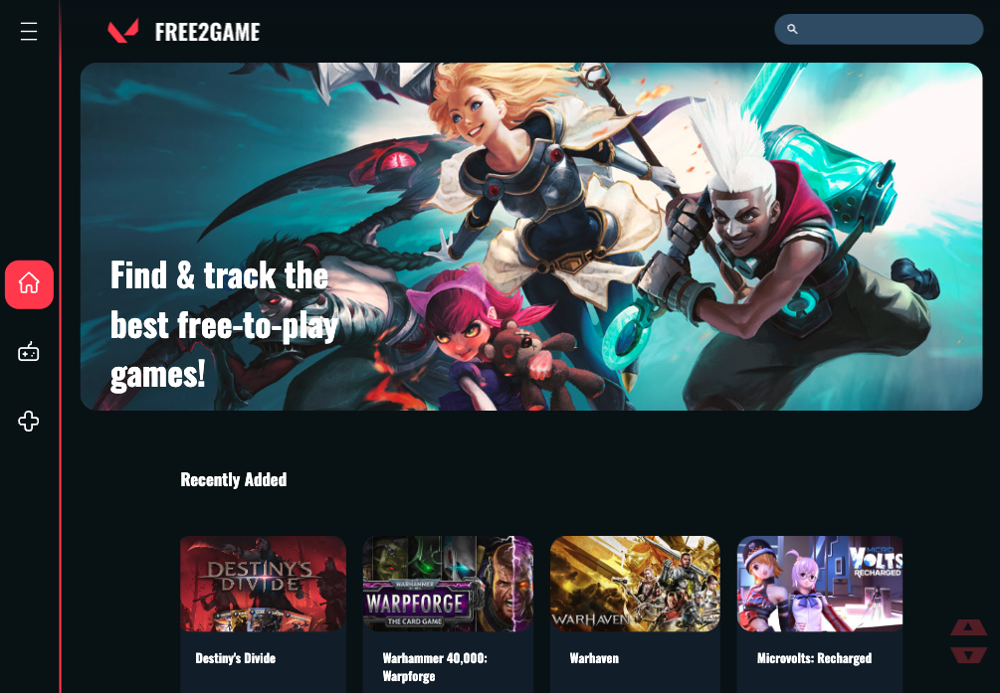
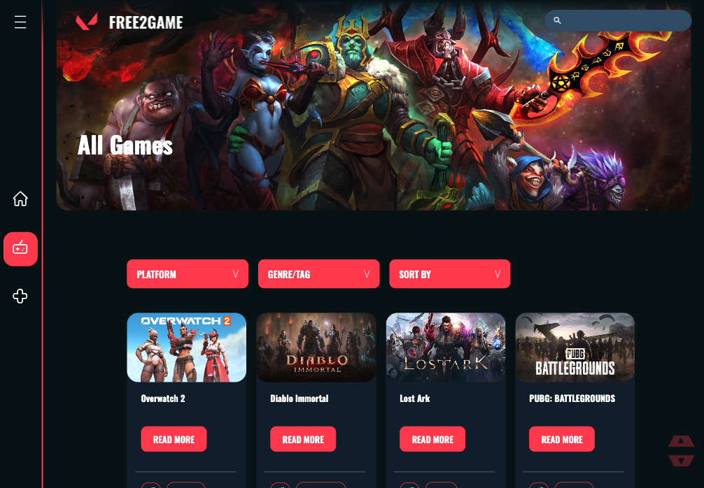
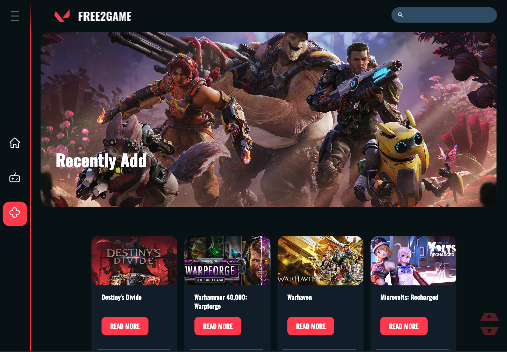
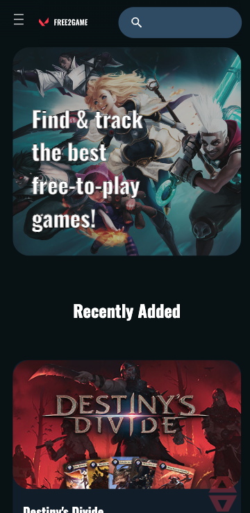
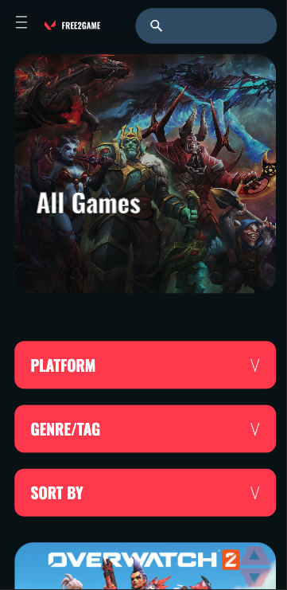
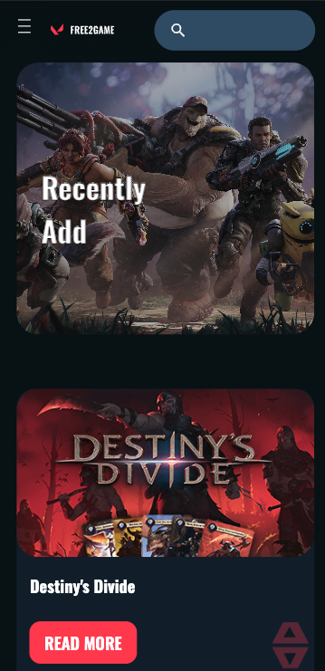

# Free2Game

Final project Fullstack Developer Supercode - (Frontend part)

42 Pull Request

154 commits

Team: Isabella, Andre, Yan, Maria

# [Vercel Deployment](https://free2-game.vercel.app/)

# [Netlify Deployment](https://magnificent-begonia-e16361.netlify.app/)

# [FigJam](https://www.figma.com/file/Ral3d2PoGd6DHfJ7HKB4rG/Untitled?type=whiteboard&node-id=0-1&t=OskslBGUuywUJFNL-0)

# Tech Stack

- React

- CSS

- Vercel

- Netlify

- Git

- npm

- react-search-autocomplete

- FigJam

- Discord

# How to set it up

- Create a local Repository in your computer

- Fork or Clone this repository in your local repository

- Install all dependencies: npm install

# Desktop

# Mobile

